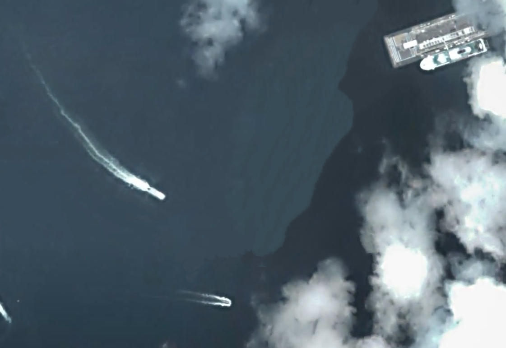

# Hierarchical Prototype Learning via Aggregation-Decomposition for Fine-Grained Geospatial Scene Graph Generation

The official implementation of the paper "Hierarchical Prototype Learning via Aggregation-Decomposition for Fine-Grained Geospatial Scene Graph Generation".

<h3>HPL-Net</h3>

  

 To address the dataset scarcity problem	 
